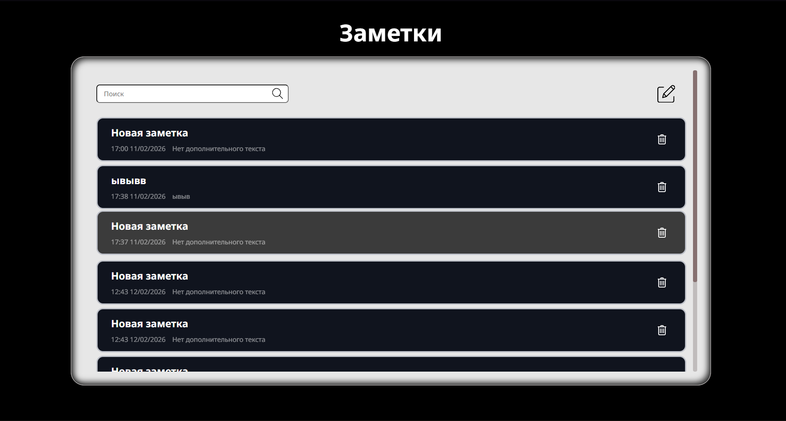

# React Notice App 📝

Веб-приложение для заметок, написанное на React.
Позволяет создавать, редактировать и удалять заметки, а также сохранять их в локальном хранилище браузера.





---

## 🚀 Технологии

- React 18 
- Vite
- TS
- React Router
- Context API
- UUID
- Scss

---

## ⚙️ Установка и запуск

1. Клонируйте репозиторий и перейдите в папку Notes:
   ```bash
   git clone https://github.com/IvanT00/Notes.git
   cd Notes
2. Установите зависимости:
   ```bash
   npm install
3. Запустите приложение в режиме разработки
   ```bash
   npm run dev